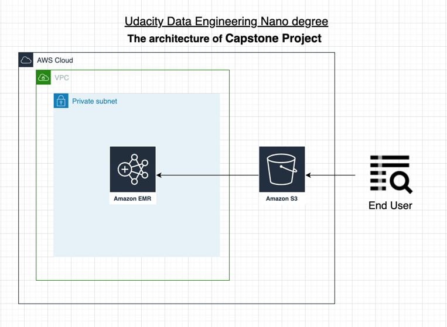

# Capstone Project

## Abstract
This project is to activate ETL process which is learned throughout the Udacity Data Engineer Nanodegree program. 

## Step 1: Scope the Project and Gather Data
The objective of this project is to ETL pipeline that extracts E-commerce selling data from S3, process ETL steps using spark,
and loads the data back into S3 as a set of dimensional tables to get data lake about E-commerce selling events.  
This lake allows marketers or analytic worker to identify which items of the target bran are sold the most on a particular date, containing e-store events

## Step 2: Explore and Assess the Data

This is an E-commerce selling data at November. 2019. It contains over 100k user`s events from E-commerce website.
There are four types of event such as view, cart, remove_from_cart, purchase including multi brand and also heaps of items

Each row has an event, all events are connected with products and users
and many-to-many relations between products and users.

### Data Information
- Original Data  
: https://www.kaggle.com/datasets/mkechinov/ecommerce-behavior-data-from-multi-category-store  
- Format : CSV format  
- File Size : 9.01 GigaBytes
 
- Data Subject : E-commerce behavior data from multi categorized product code  
- Data Name: 2019-Nov.csv  
- Data Location: AWS S3 storage  

- Key Information  
    Total Rows : over 67501 K
    Missing values:  
    - category_code :  21.9 million null  
    - brand: 9.22 million null  
   
    Key fields  
    - category_code
      - continuous string value separated by comma (.)
      - To be able to analyze hierarchical categories  

    brand  
    - it counts 4201 values  
    - able to check real brand name  
    
- Detailed information  
  [EDA-capstone.ipynb](./EDA-capstone.ipynb)  

#### Data Transformation
There are null values in the category_code, brand. And It cannot choose specific category, also time unit.
It is required to fill null value and create new field  so that we can summarize what users are looking for.

##### Transformation
- Function Name : transformProductData (process.py)
  - action 1) fill null value : brand, category
  - action 2) split code field into major, middle, minor categories respectively

- Function Name : transformEventData (process.py)
  - action 1) split time unit : year, month, day

## Step 3: Define the Data Model  

- Using the dimensional tables described below, Users can implement them on column database based on star schema.  
- This project is taken star schema so that business workers who are in data science, marketing, sales are able to activate queries,
also understand easily. finally, this model leads to get better performance and outcome.

### Tables
There are 3 dimensional tables based on raw data

- PRODUCTS: product dimension table. contains product, category, price information
- EVENTS : event dimension table. contains event information  
- USER_SESSION : user session dimension table. contains user session information

### Table Diagram
  

### Data Dictionary

#### PRODUCT TABLE
- product_id - unique identifier of a product
- category_id - unique category id of product
- category_code - unique identifier of item category. can be null
- brand - String of brand name. can be null
- price - price of product. float type

#### EVENT TABLE
- event_time - time when event happened (yyyy/mm/dd hh:mm:ss)
- event_type - Only one kind of event : purchase, view, category
- product_id - unique identifier of a product
- user_session - user`s session id. be changed when user come back to online store from a long pause.  

#### USER SESSION TABLE
- user_id - user ID to transact in the online shop
- user_session - user`s session id. be changed when user come back to online store from a long pause.  

## Step 4: Run Pipelines to Model the Data

These are specific steps to create dimensional tables with summary selling table and analyze selling data 

#### Pipeline steps
1. Load raw data using the Apache Spark from an object storage(AWS S3)
2. Create dimensional tables with cleaning null values and transforming new fields to analyze selling data
    - Create product table, will get unique values and also categorize product code
        - category_major, category_middle, category_micro
        - fill default value if null value
        - fill default values in the category_micro field if not exits
    - Create event table, will get unique values and split time unit
        - split timestamp to get data
        - create year, month, day fields
    - Create user table
3. Write dimensional tables into object storage
4. Load product data and filter what items of brand we explore
5. Create new table to summarize and analyze brand using  product and evnet table both.
    - main key is product id which is unique key in dimensional tables
6. Summarize selling price grouped by day, online store event and category_micro
7. Write summarized tables into object storage (AWS S3)
8. Apply SQL queries to understand the highest selling product, fluctuation of prices with detailed items  
   8-1. Check the result of data with applying statistical quires below  
      [Data-validation.ipynb](./Data-validation.ipynb)
   
#### Files  
- main file
  - main.py : the main python file to load and write data
  
- process file
  - process.py : collection of process ETL functions
    - load data from AWS S3 using AWS EMR
    - write parquet data in each key path
    - load parquet data , summarize data and write CSV file  

- utils file
  - util.py : assist process functions including data validation  

- Unit Test
   : unitTest.ipynb

#### Lake System

  - EMR spec
    - c5.xlarge
    - 1 master node, 3 worker node.
    
  - Data location
    : main data is too heavy to upload.   
    ** Check the s3 address below
    https://s3.console.aws.amazon.com/s3/buckets/e-commerce-sellout?region=us-west-2&prefix=nov/&showversions=false
  
## Step 5. Complete Project Write Up

- Clearly state the rationale for the choice of tools and technologies for the project
  - Due to dealing with big data, it needs to be considered such as compact, easy, economic benefits
  - AWS, the best public cloud service, and Apache spark with python is ideal to match requirements as mentioned above
- Propose how often the data should be updated and why
- It continues new data with new time stamp. This data lake such as pyspark with S3 will be updated daily
  so that clients can summarize sell results and analyze what is the most selling in the E-commerce market.
- Write a description of how you would approach the problem differently under the following scenarios:
  - Scenario1 : The data was increased by 100x
    - A: This lake will remain. It is compact and simple to handle any problem, and able to scale out
    triggering cloud watch. Another way is optimizing code, especially shuffle action.
  - Scenario2 : The data populates a dashboard that must be updated on a daily basis by 7am every day?
    - A: To sort it out, I have to consider Apache Airflow, and exact time flow has to be developed.
  - Scenario3: The database needed to be accessed by 100+ people?
    - A: In the view of data governance, specific IAM role with exact, limited policies to access data lake can be acceptable 
    in this scenario. Massive queries , requirement of performance issue , can be solved using AWS Redshift
    as it has massively parallel action.