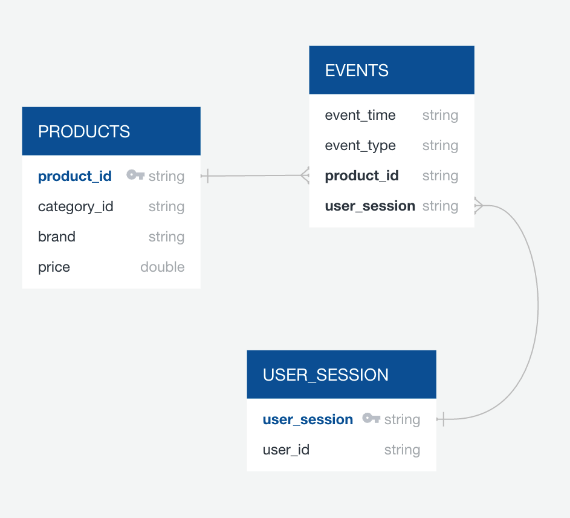

# Capstone Project

## Step 1: Scope the Project and Gather Data
This project is to activate ETL process which is learned throughout the Udacity Data Engineer Nanodegree program.

## Step 2: Explore and Assess the Data

This data contains over 100k user`s events from e-commerce website.

Each row has an event, all events are connected with products and users
and many-to-many relations between products and users.

### Data Information
- Original Data  
: https://www.kaggle.com/datasets/mkechinov/ecommerce-behavior-data-from-multi-category-store
- Type : CSV (Comma Separate Value)
- Memory 9.01 GB
- Name: 2019-Nov.csv
- Location: AWS S3 storage
- Missing Data : 
  - category_code :  21.9 million null
  - brand: 9.22 million null

#### Key field
- category_code 
  - continuous string value separated by comma (.)
  - able to analyze hierarchical categories 
  
- brand
  - it counts 4201 values
  - able to check real company name

#### Data Transformation
There are null values in the category_code, brand. And It cannot choose specific category, also time unit.
It is required to fill null value and create new field  so that we can summarize what users are looking for.

##### Transformation
- Function Name : transformProductData (process.py)
  - action 1) fill null value : brand, category
  - action 2) split code field into major, middle, minor categories respectively

- Function Name : transformEventData (process.py)
  - action 1) split time unit : year, month, day

## Step 3: Define the Data Model

### Tables
- PRODUCTS: product dimension table. contains product, category, price information
- EVENTS : event dimension table. contains event information  
- USER_SESSION : user session dimension table. contains user session information

### Table Diagram

### Data fields

- event_time - time when event happened (yyyy/mm/dd hh:mm:ss)
- event_type - Only one kind of event : purchase, view, category
- product_id - unique identifier of a product
- category_id - unique category id of product
- category_code - unique identifier of item category. can be null
- brand - String of brand name. can be null
- price - price of product. float type
- user_id - Permanent user ID
- user_session - user`s session id. be changed when user come back to online store from a long pause.

## Step 4: Run Pipelines to Model the Data

- This includes process.py file
  - pipeline
    - load data from AWS S3 using AWS EMR
    - write parquet data in each key path
    - load parquet data , summarize data and write CSV file

  - EMR spec
    - m5.xlarge
    - 1 master node, 3 worker node.
      
  - Unit Test
    : unitTest.ipynb

  - Data location
    : main data is too heavy to upload. Use the s3 address below
    : https://s3.console.aws.amazon.com/s3/buckets/e-commerce-sellout?region=us-west-2&prefix=nov/&showversions=false
  
## Step 5. Complete Project Write Up

- Clearly state the rationale for the choice of tools and technologies for the project
  - Due to dealing with big data, it needs to be considered such as compact, easy, economic benefits
  - AWS, the best public cloud service, and Apache spark with python is ideal to match requirements as mentioned above
- Propose how often the data should be updated and why
- It continues new data with new time stamp. This data lake such as pyspark with S3 will be updated daily
  so that clients can summarize sell results and analyze what is the most selling in the e-commerce market.
- Write a description of how you would approach the problem differently under the following scenarios:
  - Scenario1 : The data was increased by 100x
    - A: This lake will remain. It is compact and simple to handle any problem, and able to scale out
    triggering cloud watch. Another way is optimizing code, especially shuffle action.
  - Scenario2 : The data populates a dashboard that must be updated on a daily basis by 7am every day?
    - A: To sort it out, I have to consider Apache Airflow, and exact time flow has to be developed.
  - Scenario3: The database needed to be accessed by 100+ people?
    - A: In the view of data governance, specific IAM role with exact, limited policies to access data lake can be acceptable 
    in this scenario. Massive queries , requirement of performance issue , can be solved using AWS Redshift
    as it has massively parallel action.